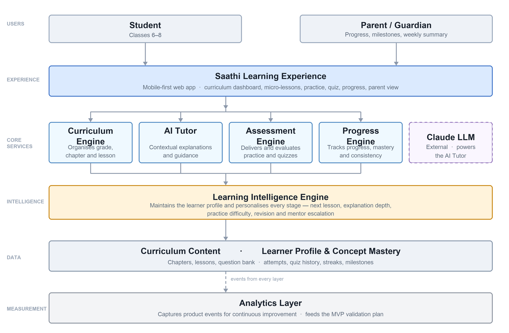

> **Note:** Converted from `PRD-original-v1.0.docx`. Product strategy source of truth.
> For anything the PRD leaves open — scope, schema, thresholds, channels — see
> [`DECISIONS.md`](./DECISIONS.md), which supersedes this document on implementation detail.

# DAGAR

## Product Requirements Document (PRD)

Version: 1.0 Stage: Buildathon MVP

### Tagline

Personalised learning for every underserved learner.

# 1. Executive Summary

## Vision

Empower every underserved learner to achieve their full potential through personalised, accessible and inclusive education.
We envision a future where every learner, regardless of their economic background, learning abilities, disabilities or access to educational resources, receives the support they need to learn confidently and independently.

## Mission

Build an AI-powered adaptive learning platform that personalises education through curriculum-aware teaching, accessibility-first design and engaging learning experiences, enabling every learner to progress at their own pace.

## Problem

Despite significant improvements in school enrolment, millions of students continue to face barriers to quality education. Many learners struggle because they lack access to personalised academic support, quality teachers or affordable tutoring.
The challenge is even greater for underserved learners, including students from economically disadvantaged communities, learners with disabilities and neurodiverse learners whose educational needs are often overlooked by traditional education systems.
Existing digital learning platforms primarily focus on content delivery through videos or generic AI conversations. While these platforms improve access to information, they rarely provide structured, adaptive and curriculum-aware learning journeys tailored to each learner.
Parents also want to support their children's education but often lack the time, subject expertise or visibility into their child's learning progress.

## Proposed Solution

Dagar is an AI-powered adaptive learning platform that delivers structured, personalised and inclusive learning experiences.
Rather than functioning as a generic AI chatbot, Dagar guides learners through a curriculum-aware journey consisting of:
- Structured curriculum pathways
- Bite-sized concept lessons
- Context-aware AI tutoring
- Guided practice
- Chapter assessments
- Progress tracking
- Habit-building experiences
- Parent engagement
- Human mentor escalation when additional support is needed

## Buildathon MVP

To validate the core learning experience, the Buildathon MVP intentionally focuses on one subject while building a scalable foundation.
Target Users
- Students studying NCERT Mathematics (Classes 6–8)
- Parents supporting their learning journey
Core Features
- Curriculum-based chapter learning (English + Hindi)
- AI Tutor
- Guided Practice
- Chapter Quiz
- Progress Tracking
- Daily Learning Streak
- Parent Progress Summary
- Request a Human Mentor
Dagar ships **bilingual — English and Hindi** — from the MVP. Dagar's learners are
disproportionately in Hindi-medium government schools; for them an English-only
interface is not a missing feature but a barrier to entry, and adaptive
personalisation is worth nothing to a learner who cannot read the lesson. Language
access is therefore treated as a Must Have, ahead of personalisation.

The architecture is designed to scale across additional subjects, grades, languages and accessibility requirements in future releases.

## Success Criteria

The MVP aims to validate the following hypotheses.
- Students complete structured learning journeys more consistently.
- Context-aware AI explanations improve conceptual understanding.
- Immediate practice improves learning outcomes.
- Parent engagement improves learner consistency.
- Human mentor requests identify situations where AI support alone is insufficient.
- Habit-forming mechanisms improve learner retention.

# 2. Problem Statement

## Background

Education is one of the strongest drivers of long-term social and economic mobility. While India has significantly improved school enrolment, learning outcomes continue to remain a challenge, particularly among underserved learners.
Students often progress through school without mastering foundational concepts because of overcrowded classrooms, limited teacher attention and the absence of personalised academic support beyond school hours.
For many families, private tuition remains financially inaccessible. Students who struggle in classrooms frequently have no reliable source of academic guidance once they return home.
Parents want to support their children but often face their own constraints, including limited subject knowledge, work commitments and uncertainty about their child's learning progress.
Recent advances in Artificial Intelligence have made personalised education technically feasible. However, most AI-powered tools remain generic—they answer questions but do not understand the learner's curriculum, learning history or conceptual gaps.

## Problem Statement

Underserved learners need an affordable learning companion that understands what they are learning, adapts to their pace, and supports them throughout their educational journey rather than simply providing answers.
Parents need meaningful visibility into their child's learning progress so they can provide encouragement and timely support without requiring subject expertise.
Some learners may also require human intervention when AI alone is unable to resolve conceptual or motivational barriers.

## Why Existing Solutions Fall Short

Current educational products solve only fragments of the learning journey.
- Video platforms deliver content but cannot personalise teaching.
- Generic AI assistants answer questions but lack curriculum awareness.
- Practice platforms assess performance but rarely adapt instruction.
- Private tutoring provides personalisation but remains expensive and difficult to scale.
- Parent communication is often limited to examination results instead of continuous learning progress.
Learners require a unified experience that combines personalised teaching, practice, motivation and family engagement.

## Opportunity

The convergence of AI, increasing smartphone adoption and structured digital curricula presents an opportunity to build an adaptive learning platform that makes personalised education affordable, inclusive and scalable.
By combining AI with structured curriculum, parent engagement and optional human mentorship, Dagar can support learners across diverse educational needs.

# 3. Market Validation

## Key Insights

The product direction is informed by educational research and observed gaps in existing learning platforms.
| Observation | Product Decision |
|---|---|
| Foundational learning gaps remain significant despite improved school enrolment. | Focus on concept mastery rather than syllabus completion. |
| Smartphone availability among school-age learners has increased considerably. | Design a mobile-first experience. |
| Students benefit from personalised instruction and immediate feedback. | Position AI as a contextual tutor instead of a generic chatbot. |
| Learning consistency is often a bigger challenge than content availability. | Introduce streaks, progress tracking and habit-building mechanisms. |
| Parents significantly influence learning habits but often lack visibility into progress. | Build parent-facing progress summaries and recommendations. |
| AI cannot solve every learning challenge independently. | Provide optional human mentor escalation for learners requiring additional support. |
| Existing platforms either provide structured content or AI assistance but rarely integrate both. | Differentiate through curriculum-aware adaptive learning. |

## Product Hypotheses

The Buildathon MVP will validate the following hypotheses. Each prioritised
capability maps to exactly one hypothesis. Success indicators are defined in
Section 12.

H1: Structured chapter-based learning improves learning consistency.
H2: Curriculum-aware AI explanations improve conceptual understanding.
H3: Practice immediately after a lesson improves mastery.
H4: Personalised recommendations increase lesson completion.
H5: Progress tracking and streaks improve learner retention.
H6: Parent engagement improves learner consistency.
H7: Learners who remain stuck will request human mentor support.

# 4. Market Opportunity

Dagar is designed as a long-term adaptive learning platform for underserved learners.
The Buildathon MVP validates one focused learning journey while establishing the foundation for future expansion.
Market sizing is India-only. Figures are derived estimates; the full derivation,
inputs and confidence levels are in `MARKET_AND_PRICING.md`.

| Market | Scope | Learners | Value (₹500/learner/yr) |
|---|---|---|---|
| Total Addressable Market (TAM) | All school-going learners in India requiring personalised, accessible and inclusive education (Classes 1–12). | ~248 million | ₹12,400 Cr (~$1.46B) |
| Serviceable Available Market (SAM) | Classes 6–8 following NCERT or NCERT-aligned state curricula, with household smartphone access. | ~30 million | ₹1,500 Cr (~$176M) |
| Serviceable Obtainable Market (SOM) | Three-year reach via government school pilots, NGOs and CSR-led education programmes. | ~250,000 (≈0.8% of SAM) | ₹10–11 Cr (~$1.25M ARR) |

SAM is derived by narrowing upper-primary enrolment (~65M) by NCERT alignment
(~62%) and household smartphone access (~75%). For a social-impact product,
**learners reached is the headline metric**; revenue is the sustainability
constraint rather than the goal.

## Monetisation Model

The Buildathon MVP is **free**. The objective at this stage is validating the
hypotheses in Section 12; introducing pricing would contaminate the activation and
retention metrics that determine whether the product works at all. Free is a
deliberate stage, not an absent model.

The model that follows is shaped by one constraint: Dagar's learners are defined
by their inability to afford tuition. A consumer subscription cannot be the primary
revenue engine without contradicting the product's own targeting.

> **Learners never pay for the core learning loop. Institutions pay for reach;
> families pay only for depth.**

| Tier | Price | Includes |
|---|---|---|
| Dagar Free | ₹0 | Full curriculum, micro-lessons, practice, quizzes, progress, streaks, milestones and parent summaries. AI Tutor capped at 10 questions per day. |
| Dagar Plus | ₹99/month · ₹799/year | Unlimited AI Tutor, adaptive practice depth, revision plans and detailed parent insights. |
| Dagar Mentor | +₹299/month | Adds human mentor sessions. Gated on verified mentor supply. |
| Dagar for Institutions | ₹450–600/learner/year | NGO, CSR and government licences with cohort dashboards and reporting. The scalable revenue engine. |

Pricing is bounded below by cost: at the Section 13 targets, a fully active learner
costs approximately ₹370/year in AI inference and infrastructure. No institutional
licence is priced below that floor.

Weighting revenue towards institutions reflects two realities — free-to-paid
conversion among underserved consumers is realistically 1–2%, and CSR education
spending in India is both mandated and structurally suited to per-learner
programmes.

| Phase | Commercial stage |
|---|---|
| Phase 1 — MVP | Free. Validate H1–H7. No pricing experiments. |
| Phase 2 | First paid CSR and NGO pilots; test institutional willingness to pay for outcomes. |
| Phase 3 | Consumer Plus launch, institutional volume tiers and mentor network. |

## Why Start with Mathematics?

Although Dagar's long-term vision spans multiple subjects and learner groups, the MVP focuses on Mathematics for Classes 6–8 because:
- Mathematical learning gaps are measurable.
- Concept mastery can be objectively assessed.
- AI explanations and guided practice provide immediate value.
- NCERT provides a structured curriculum suitable for rapid validation.
This focused scope allows the team to validate the core product experience while building an architecture capable of expanding across subjects, grades and learner needs.

## Product Roadmap

### Phase 1 – Buildathon MVP

- NCERT Mathematics (Classes 6–8)
- AI Tutor
- Guided Practice
- Chapter Quiz
- Progress Tracking
- Parent Progress Summary
- Request Human Mentor

### Phase 2 – Product Expansion

- Additional subjects
- More grade levels
- Additional regional languages (Marathi, Tamil, Bengali)
- Personalised learning paths
- Parent recommendations
- Teacher dashboard
- NGO dashboard

### Phase 3 – Inclusive Learning Platform

Expand Dagar into an accessibility-first learning platform supporting:
- Learners with visual impairments
- Learners with hearing impairments
- Learners with speech impairments
- Neurodiverse learners (e.g. ADHD, Dyslexia)
- Voice-first learning
- Offline learning
- AI-powered accessibility features
- Verified mentor network

# 5. Target Users

## Primary Persona — Student

### Lakshmi (Representative Persona)

Replaced a boy called Aarav on 3 Aug 2026. Girls are over-represented among the
learners Dagar exists for — likeliest to be pulled out when money is short, and
likeliest to have their education treated as optional — so a boy in the primary
slot was quietly describing an easier case than the one we build for.

| Attribute | Details |
|---|---|
| Age | 11–14 years |
| Grade | Classes 6–8 |
| Curriculum | NCERT Mathematics, **Hindi medium** |
| Device | Shared Android smartphone — usually a parent's, in the evening |
| Background | Underserved learner with limited access to personalised academic support |
| Goals | Understand concepts, improve confidence, complete homework and perform better in school |
| Frustrations | Classroom teaching moves too quickly, doubts remain unresolved, tuition is unaffordable, and motivation decreases over time |
| Language | Her textbook is in Hindi; most help she finds online is not |

### Student Needs

- Curriculum-aligned learning
- Personalised explanations
- Immediate doubt resolution
- Guided practice
- Motivation to learn consistently
- Confidence building
- Access to human support when AI is insufficient

## Secondary Persona — Parent / Guardian

### Suresh (Representative Persona)

Lakshmi's father. He cooks at a small restaurant in another city and sends money
home; he calls on Sunday and asks whether she is studying, and "yes" is the only
answer available to either of them. **He is not absent, he is uninformed** — and
the distinction is the whole design of the parent loop: he wants to be included
in her progress, not merely notified about fees.

He is why the weekly summary needs **no parent account** and arrives on WhatsApp.
An app to download and an account to create is a barrier for a man working
split shifts eight hundred kilometres away; a message he can read on a Sunday
call is not.

| Attribute | Details |
|---|---|
| Role | Support and encourage; often living apart for work |
| Goals | Know whether she is actually studying, and be part of it rather than told about it |
| Challenges | Distance, long shifts, limited subject expertise, no visibility into daily learning |
| Needs | Simple progress updates that reach him where he already is, with something concrete to ask her about |

### Parent Value Proposition

Dagar empowers parents to actively support learning without requiring them to teach the curriculum.
Parents can:
- Monitor chapter completion
- Track learning consistency
- Understand strengths and improvement areas
- Celebrate milestones
- Receive recommendations for supporting their child
- Respond when a learner requests additional human support

## Future Personas

As Dagar evolves, the platform will expand to support additional learner groups and institutional stakeholders.

### Learners

- Students with visual impairments
- Students with hearing impairments
- Students with speech impairments
- Neurodiverse learners (e.g. ADHD, Dyslexia)
- Adult literacy learners

### Institutional Users

- Teachers
- Government schools
- NGOs
- CSR education programmes
- Volunteer mentors

## Product Principles

Every experience within Dagar is guided by six principles:
- Inclusive — Education should adapt to every learner.
- Personalised — Every learner progresses at their own pace.
- Curriculum-Aware — AI teaches within the learner's educational context.
- Human-Centred — AI scales learning, while human mentors provide support when needed.
- Engaging — Positive reinforcement builds consistent learning habits.
- Accessible — Every feature is designed to reduce barriers to quality education.

# 6. Jobs To Be Done (JTBD)

The Jobs-to-be-Done (JTBD) framework captures the functional, emotional and social outcomes Dagar aims to deliver for each user group. These jobs guide feature prioritisation and product decisions.

## 6.1 Student JTBD

### Primary JTBD

When I struggle to understand a concept, I want personalised explanations, guided practice and continuous feedback so that I can confidently master the topic independently.
| Job Type | Jobs |
|---|---|
| Functional | Learn concepts aligned to my school curriculum. |
| Functional | Ask questions whenever I get stuck. |
| Functional | Practise concepts until I understand them. |
| Functional | Assess my understanding through quizzes. |
| Functional | Resume learning from where I left off. |
| Emotional | Feel confident while learning independently. |
| Emotional | Stay motivated to continue learning regularly. |
| Social | Improve my academic performance and share progress with my parents. |

## 6.2 Parent / Guardian JTBD

### Primary JTBD

When my child is learning independently, I want meaningful progress updates and actionable recommendations so that I can support their learning without teaching every concept myself.
| Job Type | Jobs |
|---|---|
| Functional | Monitor my child's learning progress. |
| Functional | Identify learning gaps early. |
| Functional | Encourage consistent learning habits. |
| Emotional | Feel confident that my child is progressing. |

## 6.3 Future JTBD – Human Mentor

### Primary JTBD

When a learner requests support, I want sufficient learning context so that I can provide meaningful guidance quickly.

# 7. Solution Overview

## 7.1 Learning Journey

Home
 ↓
Choose Chapter
 ↓
Micro Lesson
 ↓
AI Tutor
 ↓
Guided Practice
 ↓
Chapter Quiz
 ↓
Learning Insights
 ↓
Continue Learning
If repeated learning difficulties are detected:
AI Tutor
 ↓
Repeated Struggles Detected
 ↓
Request Human Mentor
Parents receive personalised progress summaries throughout the learner journey.

## 7.2 Product Architecture

The MVP consists of five primary capabilities.
| Capability | Purpose |
|---|---|
| Curriculum Engine | Organises learning by grade, subject, chapter and lesson. |
| Learning Intelligence Engine | Personalises learning using learner behaviour and performance. |
| Learning Experience | Delivers lessons, AI tutoring, practice and quizzes. |
| Parent Companion | Provides progress updates and recommendations. |
| Human Mentor Escalation | Enables learners to request additional support when required. |

## 7.3 Learning Intelligence Engine

The Learning Intelligence Engine powers all adaptive experiences across Dagar.
Rather than functioning as a standalone feature, it continuously analyses learner behaviour to personalise every stage of the learning journey.

### Learner Context

The engine maintains:
- Grade
- Subject
- Chapter
- Current lesson
- Completed lessons
- Quiz history
- Practice history
- Incorrect concepts
- Frequently asked doubts
- Learning pace
- Learning streak
- Preferred explanation complexity

### Intelligence Capabilities

The engine continuously:
- Recommends the next lesson
- Personalises AI explanations
- Adapts practice difficulty
- Suggests revision topics
- Generates learner insights
- Creates parent summaries
- Detects repeated struggles
- Recommends human mentor support

### AI Design Principles

| Principle | Description |
|---|---|
| Curriculum-Aware | AI always understands where the learner is in the curriculum. |
| Context-Aware | Responses consider previous interactions and learner history. |
| Adaptive | Explanations and practice adjust based on learner performance. |
| Supportive | AI guides learners with hints before revealing answers. |
| Escalation-Aware | AI recommends mentor support when repeated struggles are detected. |

# 8. User Stories

| User | User Story |
|---|---|
| Student | As a student, I want to browse chapters so I know what to learn next. |
| Student | As a student, I want concise lessons so that I understand one concept at a time. |
| Student | As a student, I want contextual AI explanations so that I can continue learning independently. |
| Student | As a student, I want adaptive practice questions so that I strengthen weak concepts. |
| Student | As a student, I want quizzes after every chapter so that I can measure my understanding. |
| Student | As a student, I want personalised learning recommendations so I always know what to study next. |
| Parent | As a parent, I want meaningful progress summaries so that I know when my child needs encouragement. |
| Student | As a student, I want to request a mentor whenever AI is unable to resolve my doubts. |

# 9. Feature Specifications

## Prioritisation Framework

Features are prioritised using the MoSCoW Framework. Every feature must directly satisfy one or more Jobs-to-be-Done.
| Feature | User Problem | JTBD | User Story | Acceptance Criteria | Priority | Success Metric |
|---|---|---|---|---|---|---|
| Curriculum Dashboard | Students don't know where to start. | Learn chapter-by-chapter. | Browse curriculum and continue learning. | Displays class, chapters, lesson progress and recommended next lesson. | Must | Lesson Start Rate |
| Micro Lessons | Long lessons reduce engagement. | Learn concepts in manageable steps. | Learn one concept at a time. | Lessons are concise, structured and curriculum-aligned. | Must | Lesson Completion Rate |
| AI Tutor | Doubts remain unresolved after class. | Get personalised explanations. | Ask contextual questions. | Maintains lesson context and provides adaptive explanations. | Must | AI Resolution Rate |
| Guided Practice | Students forget concepts quickly. | Reinforce learning through practice. | Practise immediately after learning. | Practice adapts to learner performance and provides instant feedback. | Must | Practice Completion Rate |
| Chapter Quiz | Students cannot assess mastery. | Measure understanding. | Complete quizzes after each chapter. | Quiz records mastery level and recommends revision. | Must | Quiz Completion Rate |
| Learning Intelligence Engine | Learning is identical for every student. | Receive personalised learning. | Get recommendations tailored to my learning journey. | Generates lesson recommendations, adaptive explanations, revision plans and learning insights. | Must | Recommendation CTR, Repeat Learning Rate |
| Progress & Streaks | Students lose motivation over time. | Stay consistent. | Track achievements and learning streaks. | Displays progress, streaks, achievements and milestones. | Must | 7-Day Retention |
| Parent Companion | Parents lack visibility into learning. | Monitor and support learning. | Receive learner insights and recommendations. | Weekly progress summaries and personalised parent recommendations. | Should | Parent Engagement Rate |
| Human Mentor Request | AI cannot solve every learning challenge. | Request additional support. | Escalate to a human mentor. | Mentor request captures learner context and question history. | Should | Mentor Request Rate |

# 10. MVP Prioritisation

| Priority | Capability | Validation Objective |
|---|---|---|
| Must Have | Curriculum Dashboard | Validate structured curriculum navigation. |
| Must Have | Micro Lessons | Validate bite-sized learning. |
| Must Have | AI Tutor | Validate contextual AI teaching. |
| Must Have | Guided Practice | Validate concept reinforcement. |
| Must Have | Chapter Quiz | Validate concept mastery. |
| Must Have | Learning Intelligence Engine | Validate personalised learning recommendations and adaptive behaviour. |
| Must Have | Progress & Streaks | Validate learner retention and habit formation. |
| Should Have | Parent Companion | Validate parent engagement. |
| Should Have | Human Mentor Request | Validate demand for human intervention and identify scenarios where AI alone is insufficient. |
| Must Have | Hindi Language Support | Validate that language access, not personalisation, is the first barrier for underserved learners. Full UI, AI Tutor and curriculum content in Hindi. |
| Could Have | Adaptive Learning Paths | Expand personalisation across the curriculum. |
| Could Have | Additional Regional Languages | Marathi, Tamil, Bengali — the storage model already supports them. |
| Won't Have (MVP) | Teacher Dashboard | Planned for institutional users. |
| Won't Have (MVP) | NGO Dashboard | Planned for partner organisations. |
| Won't Have (MVP) | Accessibility Modes (e.g. screen reader optimisation, sign-language support) | Planned for future inclusive learning releases. |

# 11. Success Metrics

This answers: How will we measure product success?

### North Star Metric (NSM)

Weekly Learning Minutes per Active Learner (WLMAL)
Why this NSM?
- Measures meaningful engagement instead of app opens.
- Rewards consistent learning behaviour.
- Aligns with the mission of improving learning outcomes.
- Less vulnerable to vanity metrics than downloads or registrations.

### Supporting Metrics

| Objective | KPI | Why it Matters |
|---|---|---|
| Acquisition | New learner registrations | Measures reach. |
| Activation | % learners completing their first lesson | Indicates successful onboarding. |
| Engagement | Lessons completed per learner/week | Measures ongoing usage. |
| Learning Outcomes | Chapter quiz mastery rate | Indicates concept understanding. |
| Retention | Day-7 and Day-30 learner retention | Measures long-term value. |
| Personalisation | Recommendation acceptance rate | Validates AI recommendations. |
| AI Effectiveness | AI doubt resolution rate | Measures usefulness of AI Tutor. |
| Parent Engagement | Weekly summary open rate | Indicates parent involvement. |
| Learning Support | Mentor request rate | Identifies where AI is insufficient. |

# 12. Analytics & MVP Validation Plan

### Product Hypotheses

These are the hypotheses defined in Section 3, with the indicator used to evaluate each.

| ID | Hypothesis | Success Indicator | Capability Validated |
|---|---|---|---|
| H1 | Structured chapter-based learning improves learning consistency. | Lesson completion ≥ 50%. | Curriculum Dashboard, Micro Lessons |
| H2 | Curriculum-aware AI explanations improve conceptual understanding. | AI Tutor adoption ≥ 50% of active learners. | AI Tutor |
| H3 | Practice immediately after a lesson improves mastery. | Practice completion ≥ 60%; higher quiz scores among practice-completers. | Guided Practice, Chapter Quiz |
| H4 | Personalised recommendations increase lesson completion. | Recommendation acceptance ≥ 30%. | Learning Intelligence Engine |
| H5 | Progress tracking and streaks improve learner retention. | Day-7 retention ≥ 25%. | Progress & Streaks |
| H6 | Parent engagement improves learner consistency. | Parent summary engagement ≥ 40%. | Parent Companion |
| H7 | Learners who remain stuck will request human mentor support. | Mentor requests cluster on identifiable concepts. | Human Mentor Request |

### Key Product Events

| Event | Purpose |
|---|---|
| Learner Registered | Acquisition |
| Lesson Started | Activation |
| Lesson Completed | Engagement |
| AI Question Asked | AI usage |
| Practice Started | Learning behaviour |
| Practice Completed | Reinforcement |
| Quiz Submitted | Mastery |
| Recommendation Clicked | Personalisation |
| Parent Summary Viewed | Parent engagement |
| Mentor Request Submitted | Human support demand |

### MVP Success Criteria

| Goal | Target |
|---|---|
| First lesson completion | ≥60% of new learners |
| Lesson completion | ≥50% |
| AI Tutor adoption | ≥50% of active learners |
| Practice completion | ≥60% |
| Recommendation acceptance | ≥30% |
| Day-7 retention | ≥25% |
| Parent summary open rate | ≥40% |

These targets are initial benchmarks for evaluating product direction during the MVP phase and should be refined as real user data becomes available.

# 13. High-Level Technical Architecture

*Regenerate with `python3 scripts/gen-architecture-diagram.py`.*

### Core Components

| Component | Responsibility |
|---|---|
| Curriculum Engine | Organises learning content by curriculum structure. |
| Learning Intelligence Engine | Maintains learner profiles and generates personalised recommendations. |
| AI Tutor | Provides contextual explanations and guidance. |
| Assessment Engine | Delivers and evaluates practice and quizzes. |
| Progress Engine | Tracks learner progress, mastery and consistency. |
| Analytics Layer | Captures product events for continuous improvement. |

# 14. Risks, Assumptions & Mitigations

| Risk | Assumption | Mitigation |
|---|---|---|
| AI explanations may be inaccurate. | Curriculum-grounded prompts improve reliability. | Review prompts, validate responses and include feedback mechanisms. |
| Learners may lose motivation over time. | Progress visibility encourages consistency. | Use streaks, milestones and personalised reminders. |
| Parents may not engage regularly. | Simple insights are easier to consume than detailed reports. | Deliver concise weekly summaries with clear next steps. |
| AI may not resolve every doubt. | Complex cases benefit from human support. | Provide Learning Support Network escalation. |
| Limited MVP usage may reduce confidence in results. | Early users still provide valuable behavioural insights. | Focus on qualitative feedback alongside analytics and iterate quickly. |

# 15. Product Roadmap

| Phase | Focus | Key Deliverables |
|---|---|---|
| Phase 1 – MVP | Validate core learning experience | Curriculum Dashboard, AI Tutor, Practice, Quiz, Progress, Parent Connect, Learning Support Network |
| Phase 2 – Intelligence | Improve personalisation | Adaptive learning paths, additional regional languages, voice interactions, AI revision plans |
| Phase 3 – Scale | Expand reach and accessibility | Additional subjects, teacher dashboard, NGO dashboard, accessibility features, offline learning, CSR partnerships |

# 16. Decision Register

**Every implementation decision, indexed here, with the reasoning in
`docs/DECISIONS.md`.**

### Why this is an index and not the decisions themselves

This document has two readers who want opposite things. A judge, a partner or an
investor reads it end to end and needs the argument; whoever is building reads it
to answer "what did we decide about X, and why". Putting *"practice is offered at
a concept boundary, not after every lesson"* into §7 would bury a strategy
document under implementation detail and still leave the reasoning nowhere.

So the split is deliberate: **the PRD says what we are building and why it
matters; `DECISIONS.md` says what we chose when the PRD left a choice open, and
why.** The register below is what makes that split safe — nothing is reachable
only by reading code.

**The rule stands: where the two disagree, `DECISIONS.md` wins and the PRD gets a
follow-up edit.** It is written later, against a real product, by someone who has
already hit the problem.

### The register

| # | Decision | In short |
|---|---|---|
| D1 | Curriculum scope & content source | New NCERT (Ganita Prakash) only; one chapter per grade in the MVP |
| D2 | Accounts & parent linking | Learner owns the account; a parent reads via link or code, and never writes |
| D3 | Question bank & grading | Grading is deterministic code, never AI; `1/2`, `2/4` and `0.5` all mark correct |
| D4 | Parent summaries | WhatsApp where opted in, in-app otherwise |
| D5 | Mastery | Per concept, over the last five attempts; ≥0.8 with ≥3 attempts is mastered |
| D6 | Struggle detection | What triggers a mentor escalation |
| D7 | Streaks | One lesson **or** five practice questions a day; one forgiven day per rolling week; IST |
| D7b | Milestones | The badge catalogue and how it is awarded |
| D8 | Mentor requests | An inline offer, never a modal, never a diagnosis |
| D9 | Stack | Next.js · Supabase · Vercel · Claude |
| D10 | Accessibility | WCAG AA is in the MVP, not a later phase |
| D11 | Non-functional targets | Latency, cost and retention budgets |
| D12 | Canonical hypotheses | Resolves the §3 / §12 conflict in this document |
| D14 | Commercial model | Free tier and Dagar Plus |
| D15 | Distribution | PWA now, Play Store later |
| D16 | Hindi | In the MVP, not Phase 2 — the learners are Hindi-medium |
| D17 | Habit mechanics | What transfers from Duolingo, and what inverts for a learner already behind |
| D17b | Reminder notifications | Two a day, the second conditional; silent once the goal is met |
| D18 | Lessons are steps, not prose | One idea per screen, with a visible finish line |
| D19 | Navigation feels instant | Or the work behind it does not count |
| D20 | Practice at a concept boundary | Not after every lesson — practice for a two-lesson concept contains both lessons' questions |
| D21 | A practice set is five questions | The same five that close the daily goal, so finishing a set can never leave the ring open |
| D22 | `completed_at` never moves | Rereading a lesson is not a completion; it writes nothing |
| D23 | The progress screen has tested invariants | Where two numbers derive from one fact, their agreement is asserted, not just their rendering |
| D24 | Weekday letters are unambiguous | `M T W T F S S` had four collisions; two letters now |

### What this register is for

D20 is the reason it exists. That rule was live from the first week and written
down **only in a code comment**, so the product behaved consistently while
appearing, to anyone reading the screen, to contradict itself: one lesson ends
with "Next lesson", the next with "Practise this". It was reported as a bug. It
was not a bug — but with no entry anywhere, there was no way to tell those two
cases apart without reading `lib/learning/nextStep.ts`.

**A decision that exists only in code is indistinguishable from an accident.**

`tests/unit/decision-register.test.ts` fails the build when a decision is added to
`DECISIONS.md` and not to this table, naming the missing number. An index nobody
maintains is worse than no index, because it looks complete.

# 17. Appendix

## Key Assumptions

- Learners have access to a smartphone or web browser.
- NCERT curriculum provides sufficient structure for the MVP.
- AI responses are grounded in curriculum content.
- Parents are willing to receive periodic progress updates.
- Human support is limited and used only for escalation.

### Experiment Backlog

| Experiment | Hypothesis | Success Metric |
|---|---|---|
| Adaptive recommendations | Personalisation increases lesson completion. | Recommendation acceptance rate |
| AI-generated practice | Adaptive practice improves learning outcomes. | Quiz mastery rate |
| Parent Connect | Parent engagement improves learner consistency. | Weekly active learners with engaged parents |
| Learning Support Network | Human intervention improves outcomes for struggling learners. | Completion rate after mentor requests |

